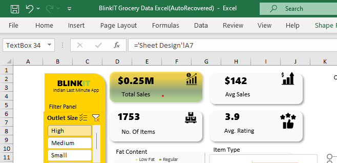
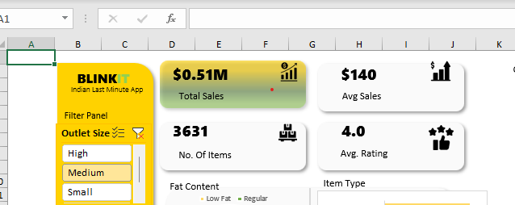

Hello,
Welcome to my Data Analyst Portfolio!

I am a data analyst with experience in using various tools and technologies to collect, organize, and analyze data to inform business decisions. I am proficient in Excel, SQL, and Power BI, and have a solid understanding of data analytics techniques such as dashboard building, report writing, data mining, data merging, statistics, and critical thinking.

In this portfolio, I have included various projects showcasing my data analytics skills. You will find links to the dashboards and reports I have created using various tools such as Power BI, and Excel. These projects demonstrate my ability to analyze and present data clearly and visually appealingly, making it easy for decision-makers to understand the insights and take action.

Explore my projects to see how I use data to drive impactful solutions!

Thank you for visiting my portfolio, and I look forward to connecting with you! 😃


## Table of Contents
- [BlinkIT Grocery Data](Excel)
- [Company Database](SQL)
- [Car Sales Analysis](Car-Sales-Analysis)
- [Call Center Analysis](Call-Center-Analysis)
- [Road Accident Analysis](Road-Accident-Analysis)
- [Electric Vehicle Analysis](Electric-Vehicle-Analysis)
- [Certifications](Certifications)
- [Contacts](Contacts)

  
# BlinkIT Grocery Data
## Project Overview
This project offers a comprehensive analysis of Blinkit's sales performance, customer satisfaction, and inventory distribution to identify key insights and opportunities for optimization using various KPIs and visualizations in Excel.  The KPI's Requirements are to calculate:  
- Overall revenue generated from all items sold
- Average revenue per sale.
- Total count of different items sold
- Average customer rating for items sold

  ## Dashboard


## Data Source and Methodology
For this analysis, I used data provided by Data Tutorials, which offers structured datasets for educational purposes. The data reflects transactional and sales activity for BlinkIT, an Indian last-minute grocery app.
Here's a refined version of the data: [Dataset](https://docs.google.com/spreadsheets/d/1bKY8BXqaYwGrxBrJDp13jXndhVmIXxFh/edit?usp=drive_link&ouid=118278122332705089450&rtpof=true&sd=true
) 
### Tools Used: 
- Excel, Pivot Table, VLOOKUP, Charts, and Graphs
  
I downloaded the dataset from Data Tutorials, which provides structured datasets for educational purposes. The data captures transactional information for BlinkIT, including sales performance, product categories, and outlet characteristics. The data was thoroughly cleaned to ensure accuracy, removing null values and empty datasets.
The dataset was formatted to enhance readability and consistency, preparing it for analysis.
A new Pivot Table worksheet was created to summarize key metrics.
Using the formatted Pivot Table data, an interactive and visually appealing dashboard was designed in Excel.
The dashboard includes slicers, KPIs, and graphs to enable dynamic filtering and insightful visualizations.
Additional formatting techniques enhanced the aesthetics and usability of the dashboard.

## Some Key Findings
#### 1. Outlet Performance:
Medium-Sized Outlets generate the highest revenue, accounting for 42% of total sales.
High-Sized Outlets contribute 37%, and Small-Sized Outlets account for 21%, indicating that medium-sized outlets are the most efficient in terms of revenue generation. Slicer was also generated to easily navigate through each outlet size


High Outlet          |  Medium Outlet     |  Small Outlet
:-------------------:|:--------------------|:--------------:
         |          |      


#### 2. Product Category Insights:
Fruits and Vegetables lead in sales with $178.1M, followed by Snack Foods ($175.4M) and Household Products ($136.0M). Other categories such as Frozen Foods and Dairy also show strong performance, suggesting a broad customer demand across product types.


#### 3. Regional Performance
Tier 3 and Tier 2 locations significantly outperform Tier 1 in sales. Tier 1 locations show untapped growth potential, indicating the need for targeted strategies to boost performance in these areas.

#### 4. Fat Content Preferences
Regular products dominate the sales, making up 64.6% of the total, while Low-Fat products represent 35.4%. This highlights the consumer preference for regular products over health-conscious options, though there's room for growth in low-fat product marketing.


## Data Insights for Strategic Decisions
- Focus on scaling Medium-Sized Outlets for maximum revenue.
- Invest in Tier 1 locations to tap into untapped market potential.
- Expand marketing for Low-Fat products to appeal to health-conscious consumers.

 ##Recommendations
- Focus on expanding medium-sized outlets, as they generate the highest revenue.
-  Optimize Tier 1 locations through targeted marketing to tap into their growth potential.
-  Promote low-fat product lines to appeal to health-conscious consumers
-  Increase focus on top-performing product categories like fruits and vegetables, snack foods, and household products.
 ## Disclaimer: 
The findings and recommendations presented in this analysis are based on the available dataset and may reflect trends and patterns specific to the period and geographical scope 
of the data


### Project Overview (Company Database Using SQL)

This project demonstrates my work on a company database, utilizing SQL for various data operations and analysis. The primary objective was to efficiently manage and analyze the company's data, ensuring data integrity, optimizing queries, and providing actionable insights.

### Tools

- Excel
- SQL - Data Analysis [Download here](https://popsql.com/queries/-NgTdKFsQALBG4yFGr8s/company-employees-table?access_token=032290a9335c86f70fa06c1c65499958)

  ### Exploratory Data Analysis
  
  EDA involved exploring the database to answer key questions, such as:
  - What is the total employees in the company?
  - Top highest paid employees?
  - Average salary of the employees?
  - Employees who earned more than a particular amount?
 
### Data Analysis
Include some interesting code worked with

``` SQL
SELECT *
FROM employeess
WHERE salary > 50000;
```
``` SQL
SELECT
	employee_id,
	first_name,
	last_name,
	salary
FROM employeess
WHERE salary BETWEEN 35000 AND 50000;
```

``` SQL
SELECT 
	email,
	COALESCE(email, 'NO EMAIL PROVIDED')
FROM employeess;
```


### Summary
This project showcases my ability to design, manage, and analyze employee data using SQL. It demonstrates essential skills in database management, query optimization, and data analysis, resulting in actionable insights that support business decisions and HR strategies.

### References
- SQL By Giraffe Academy
- [freecode camp](freecodecamp.org)
- [W3 Schools](https://www.w3schools.com/sql/sql_top.asp)


# Car Sales Analysis
***

***
## Objective:
This project aims to design and develop a dynamic and interactive Car Sales Dashboard using Power BI. The dashboard visualizes critical KPIs related to  car sales, helping  understand sales performance over time and make data-driven decisions.

#### Data Sources

Car Sales Data: The primary dataset used for this analysis is in the "Car-Salesdata.xlsx" file, containing detailed information about each cars.

 ### Tools
- Excel - Data Cleaning
  - [Download here](https://docs.google.com/spreadsheets/d/1uNPGZN58_9hA1N50murs20e4zpQ6z-hx/edit?usp=drive_link&ouid=118278122332705089450&rtpof=true&sd=true)
- PowerBi - Creating reports

 ### Data Cleaning/Preparation:
  In the initial data preparation phase, I performed the following tasks:
  1. Data loading and inspection.
  2. Handling missing values.
  3. Data cleaning and formatting.

 ## Problem Statement 1: KPI’s Requirement :
i.	Sales Overview :
.	Year-to-Date (YTD) Total Sales
•	Month-to-Date (MTD) Total Sales
•	Year-over-year (YOY) Growth in Total Sales
•	Difference between YTD Sales and Previous Year-to-Date (PTYD) Sales


ii.	Average Price Analysis :	
.	YTD Average Price
•	MTD Average Price
•	YOY Growth in Average Price
•	Difference between YTD Average Price and PTYD Average Price

iii.	Cars Sold Metrics :
•	YTD Cars Sold
•	MTD Cars Sold
•	YOY Growth in Cars Sold
•	Difference between YTD Cars Sold and PTYD Cars Sold


## Problem Statement 2: Charts Requirement :
1.	YTD Sales Weekly Trend
2.	YTD Total Sales by Body Style
3.	YTD Total Sales by Color
4.	YTD Cars Sold by Dealer Region
5.	Company-Wise Sales Trend in Grid Form
6.	Details Grid Showing All Car Sales Information

   


Skills / Concepts Demonstrated :
The following PowerBi features were incorporated :
- Bookmarking
- DAX
- Formatting Visuals
- Page navigation
- Time Intelligence Fxn
- Modelling
- Quick Measures
- YTD, MTD, PYTD

## Modelling
The dimension tables joined the fact table with a many-to-one relationship.

Model Used :


You can interact with the report [here] (https://app.powerbi.com/groups/75189acb-9b13-476a-8c6b-283daf4d96bc/reports/6b3af657-224f-4262-bf13-8a172b87507b/ReportSection?experience=power-bi&clientSideAuth=0)

Conclusion / Recommendations :
YTD Sales are growing with a growth rate of 23.59%
YTD sales for each car was 28k and were reduced compared to last year by 220$ with MTD Avg Price of 28.6k$ 
There was a significant growth in the YTD Cars sold

### Limitations
I had to remove all zero values from my data columns they would have affected the accuracy of my conclusion from the analysis.


## Call Center Analysis
***

***
## Objective:
To provide comprehensive insights into call center operations by analyzing key metrics. This analysis aims to help call center management identify trends, optimize resource allocation, improve customer service efficiency, and make data-driven decisions.

#### Data Source [download here](https://drive.google.com/file/d/15wcdUhtT0q7WfU84p2RVl_VPZTD36k_N/view?usp=drive_link)

 ## Problem Statement 
   - Total calls by Reason
   - Total calls by Sentiment
   - Total calls by State
   - Total calls by Calls_Centres


Skills / Concepts Demonstrated :
The following PowerBi features were incorporated :
- Bookmarking
- DAX
- Date Fxn
- Custom Charts
- SUM/SUMX
- Page navigation
- Time Intelligence Fxn
- Modelling
- Navigations


You can also interact with the report [here] (https://app.powerbi.com/groups/75189acb-9b13-476a-8c6b-283daf4d96bc/reports/6b3af657-224f-4262-bf13-8a172b87507b/ReportSection?experience=power-bi&clientSideAuth=0)


Conclusion / Recommendations :
Los Angeles had the highest calls
Denver recorded the lowest calls
***

## Road Accident Analysis
---

***
## Objective:
To provide detailed insights into road accidents by analyzing important key metrics. This analysis aims to support road safety initiatives, inform policy decisions, and enhance public awareness by identifying trends and risk factors associated with road accidents.

   ## Problem Statement 
   - Total Accidebts and Casaulties by location
   - CY Fatal Casaulties by Road type for Current year
   - CY Casaulties by Area / Location & by Day / Night
   - Monthly Trend showing comparison for Current year and Previous year

     


Skills / Concepts Demonstrated :
The following PowerBi features were incorporated :
- DAX
- Filters and Slicers
- Custom Charts
- Power Query
- Time Intelligence Fxn
- Modelling

## Modelling
The dimension tables joined the fact table with a many-to-one relationship.

Model Used :


***


You can also interact with the report [here] (https://app.powerbi.com/groups/75189acb-9b13-476a-8c6b-283daf4d96bc/reports/e5db7c8f-87b7-4d7d-94db-1720d27eb8f4/ReportSection?experience=power-bi&clientSideAuth=0)


# Electric Vehicle Analysis
---

***
## Objective:
To provide detailed insights into electric vehicle adoption and performance by analyzing key metrics. This analysis aims to analyze the technological advancements and efficiency of electric vehicles by determining the average electric range, identifying and comparing the prevalence of Battery Electric Vehicles (BEVs) and Plug-in Hybrid Electric Vehicles (PHEVs), and assessing BEV dominance in the dataset.

   ## Problem Statement 
   - Determine the average electric range of the electric vehicles to gauge the technological advancements and efficiency of the EVs.
   - Identify and analyze the total number of Battery Electric Vehicles (BEVs) in the dataset.
   - The percentage of BEVs relative to the total number of electric vehicles, providing insights into the dominance of fully electric models.
   - Identify and analyze the total number of Plug-in Hybrid Electric Vehicles (PHEVs) in the dataset.


Skills / Concepts Demonstrated :
The following PowerBi features were incorporated :
- DAX
- Statistical analysis
- Data cleaning and transformation
- Power Query
- Time Intelligence Fxn
- Modelling
- Trend analysis


## Modelling
The dimension tables joined the fact table with a one-to-one relationship.

Model Used :


***


You can also interact with the report [here] (https://app.powerbi.com/groups/75189acb-9b13-476a-8c6b-283daf4d96bc/reports/a43b8408-0c15-4835-8ae3-624412bb7333/ReportSection?experience=power-bi)


## Certification
- [Google Data Analytics Professional Certificate](https://coursera.org/share/a3ef072895884236164c64f185fb5ab4)
  
### Contacts
***
- LinkedIn: [ademola](https://www.linkedin.com/public-profile/settings?lipi=urn%3Ali%3Apage%3Ad_flagship3_profile_self_edit_contact-info%3BHVJYos61RnuSJT0ymkbrYQ%3D%3D)

- Email: ademolajohnson50@gmail.com

  

   


  


  


